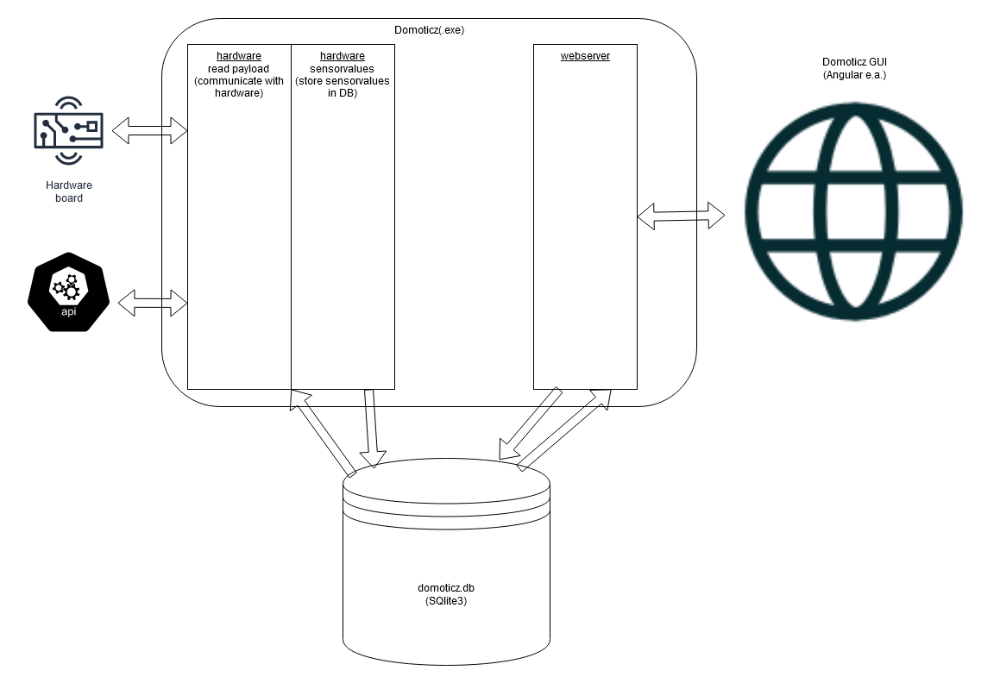

# Domoticz OpenAPI

## Overview
Domoticz is an Home Automation System that interacts with all kinds of directly connected hardware, internet-based webservices (API's, etc.) which represent all kinds of _connected_ devices and more. Sensor readings, switch statusses, etc. are represented through Domoticz __devices__.

Through the default Domoticz webUI (User Interface), or any other public available or custom UI, the user can see and interact with de these devices.

For these UI's to retrieve and interact with the devices, Domoticz has a build-in webserver that offers a webservice (API) for these UI's to interact with.

The below diagram shows a high-level overview:


Currently the Domoticz webserver has a lot of functions that have been added over the current lifespan (more that 6 years!).

## Why
As contributor to Domoticz I am looking in ways to make my contributions easier to maintain and less buggy (yes, I am not perfect either).

The current code-base of Domoticz, due to its historical growth, is not (yet) really suited (understandable) to adopt more recent methods of automated testing. So when looking into ways to better test my contributions I found that (unit-)testing the hardware _modules_ is not easy to do without having to write a hugh amount of mock-classes to isolate parts. Although I would like to go there somehow one-day, it made more sense to look at a way to isolate other aspects of Domoticz first.

From a high-level perspective (see picture above) making the UI and Webserver somehow more independant of each other, and that way easier to develop AND test seperately, seemed to me as a good point to start.

This is were more recent web-applications use things like a API-first approach, RESTful webservices, full one-page webapp UI's, etc. One of the key aspects here is the clear __contract__ between the webservice and the clients that use the webservice. 

Using a declarative-style (instead of _coded_) which is both readable but also programmaically useable (depends a bit on the language at the moment) like OpenAPI seems very appealing.

If/when the Domoticz webserver would become a RESTfull webservice with a clearly specified OpenAPI _contract_, it would bring a number of benefits:

* Better and easier testing of the webserver/webservice.
* Both the webserver and the UI (including external UI's and clients) can be developed independantly as the _contract_ acts as the 'interface' definition
* Having a clear _contract_ makes it possible to mock either the Webservice and/or clients
* Versioning of _contracts_ allows for having more that one implementation of a webservice call so new/updated methods can become available without breaking clients that have not yet adopted to the new version.
* A readable _contract_ can also act as proper documentation if done nicely.
* Bonus: You can put a (Cloud)Proxy/API-Gateway in front of your Domoticz that uses the OpenAPI spec and can act as a WebApplicationFirewall (WAF) protecting your (internal) Domoticz when only allowing access to your Domoticz via the Proxy (Look at Azure API-Management, AWS API gateway and others)

## Proof of Concept
To find out if going the OpenAPI route could work for Domoticz, I have been working on a Proof-of-Concept and written some code to test a few things.

First I extended the Domoticz Webserver to allow for a way to work with a new way to accept RESTfull-like request next to keeping the old functions working as well because I don't think a big-bang switch is a feasible route.

Second was to have a clear way in the code-base to work on possible new methods without having to hit the already very large code-base of the current webserver.

With these capabilities I was able to create an OpenAPI specification for the _new_ webservice and partly implemented some of the specified methods.

## How does it work
The Domoticz webservice has been extended and has a few new additional paths.

The new webservice is available on the URL `/api/v2` (for example http://localhost:8080/api/v2)

To see what calls can be made, open the `domoticz.openapi_v2.yml` file (in the `OpenAPI` directory, next to this README.md). Even easier and more readable is to copy the content of that file and paste it into the Swagger editor at https://editor.swagger.io (Look how nice the specification file gets rendered into great documentation!!)

Now use your browser, `curl` or even better, a tool like [Postman](https://www.postman.com/), to interact with the v2 Domoticz webservice.

```
curl -X GET "http://localhost:8080/api/v2/device/123" -H  "accept: application/json"
```

When you run Domoticz with some additional logging and debugging flags like `-loglevel normal,error,status,debug -debuglevel webserver` you can see some of the details on the processing. 


## Why /api/v2 ? Where is v1 ?
As the current methods of the Domoticz webserver have to be functional and kept around for quite some time to come, I considered these as __v1__. Hence it made sense to call the new methods _v2_ so it can easily be detected if a call is done to the existing- or new methods.

## Status
I have created some initial code in my fork to demonstrate some aspects already:

[OpenAPI branch on my fork](https://github.com/kiddigital/domoticz/tree/improvement/openapi-1) (as updated/close to the Beta branch as possible)

The code should compile fine (it does for me on Linux at least) and you get the normal great Domoticz binary WITH additionally the new Webservice to play with :)

## Mocking the Domoticz WebService (v2 and up)
You can use [Prism](https://stoplight.io/open-source/prism/) as either a Mock Service to mock the Webservice from Domoticz based just on the OpenAPI spec file. Or even use Prism as a Proxy between the UI (or any client) and the Domoticz Webservice to validate requests AND responses against the specification.

See https://meta.stoplight.io/docs/prism/docs/getting-started/01-installation.md

Easiest way to install it (I did it in the 'extern' directory)
```
curl -L https://raw.githack.com/stoplightio/prism/master/install | sh
```

Now you can launch the Mock service using the Domoticz OpenAPI specification file:
```
extern/prism-linux mock -h localhost OpenAPI/domoticz.openapi_v2.yml
```

In the same way you previously interacted with the real Domoticz webservice, you can now interact with the mock service but now on port 1410 (instead of 8080). The difference being that the responses are not real but based on the example data in the specification file :) And no need to start/run Domoticz :)

## More on OpenAPI (OAS3)

For more information on the goals, the how, the what, see the OpenAPI site at:

https://www.openapis.org/

http://spec.openapis.org/oas/v3.0.3

The OpenAPI (3) specification is the successor of Swagger (see https://swagger.io) and a real easy way to start with an OpenAPI (or Swagger) specification file is to put it in the online swagger editor:

https://editor.swagger.io

Some good info on creating a good specification can be found here : https://tyk.io/10-essentials-when-creating-an-openapi-specification/
